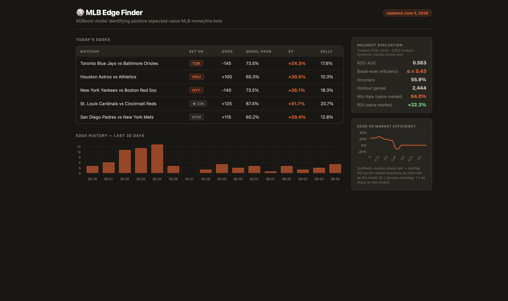

# MLB Win Probability

[](https://github.com/jaydengould/mlb-win-probability/actions/workflows/ci.yml)
[](https://www.python.org/downloads/)
[](LICENSE)

A calibrated game-level win probability model for MLB, with a daily automated
pipeline and a published prediction history.

The model is an XGBoost classifier over team, rolling-form, and starting-pitcher
features, post-hoc calibrated with isotonic regression. A GitHub Actions
workflow retrains, scores each morning's slate, and commits the predictions to
`outputs/` — 77 dated CSVs covering 2026-05-19 through 2026-08-05 at the time of
writing, of which the graded record below ends 2026-08-04 (the results cache
`data/raw/historical_2026.csv`, refreshed by the same workflow, currently ends
2026-08-04, so the three predictions published for 2026-08-05 have no final
scores to grade against yet). Every prediction in that directory was published
before the games were played, which is what makes the live record gradeable at
all.

Evaluation is a temporal holdout: train on 2019–2024, score the full 2025 season
blind. Section [Evaluation](#evaluation) reports what that showed, including the
parts that did not work.

## Dashboard

**Live:** https://jaydengould.github.io/mlb-win-probability/

Regenerated by the daily workflow. Shows the current slate's flagged games, a
30-day history of how many games were flagged per day, and the holdout metrics
read from `models/temporal_eval_2025.json`.

*The color scheme uses the SF Giants' official black (#27251F) and orange
(#FD5A1E) — a small personal touch from a lifelong Giants fan.*



## Evaluation

### There is no market baseline

The model has **not** been benchmarked against bookmaker-implied probabilities.
The repository contains no historical odds: the only 2025 odds file,
`data/raw/odds_2025-07-01.csv`, is header-only with zero rows, and the Odds API
historical endpoint requires a paid plan. Every evaluation below therefore
compares the model to itself, to a constant, or to a synthetic counterparty —
never to a real posted line.

This is a gap in the evaluation, not a result. Nothing here supports a claim
about how well or badly the market prices these games.

`win_probability.market_implied_prob()` converts American odds to a raw,
vig-inclusive implied probability. It is used only to populate the
`high_confidence` display flag. No de-vigging (normalizing the two sides to sum
to 1) is implemented anywhere in the repo.

### Temporal holdout — 2025

Trained on 2019, 2021–2024 (2020 excluded, 60-game season), scored blind on the
full 2025 season. Source: `models/temporal_eval_2025.json`.

| Metric | Model | Constant baseline |
|---|---|---|
| ROC-AUC | 0.5626 | 0.5 by construction |
| Log loss | 0.6836 | 0.6899 |
| Brier score | 0.2453 | 0.2484 |
| Accuracy | 0.5589 | — |
| n (holdout games) | 2,444 | 2,444 |
| n (training games) | 12,599 | — |

The constant baseline predicts the 2019–2024 home-win base rate (0.5252) for
every game, using no inputs at all. It is computed from
`data/processed/training_2019-2026.csv`; the model figures are from
`models/temporal_eval_2025.json`.

The model's improvement over a no-input constant is **0.0063 log loss**.

### Known limitation: look-ahead in team stats

`training_data._build_season()` joins team batting and pitching features from
`fetch_stats(date(season, 9, 28))` — end-of-season values. Every row for a
season carries that season's finished team performance, including the holdout
rows. A 2025 game played in April is scored with features that encode how those
teams' 2025 seasons turned out.

This is the **team-stat look-ahead**, and it flatters every number in the table
above. **The true out-of-sample figure is unknown and lower than 0.5626 ROC-AUC /
0.6836 log loss.** The improvement over a no-input constant is 0.0063 log loss —
small enough that the team-stat look-ahead could plausibly account for all of it.
The repo cannot bound the size of that look-ahead, so it cannot rule that out. What
the holdout establishes is an upper bound, not a measured skill level.

Starting-pitcher features do not have this problem — they are joined from
time-matched snapshots strictly preceding each game (see
[Time-matched pitcher snapshots](#time-matched-pitcher-snapshots)). Team stats
were never given the same treatment.

Corroborating evidence: the 2026 partial holdout
(`models/temporal_eval_2026.json`, trained 2019–2025, n=794 games) gives ROC-AUC
**0.5259** and log loss **0.7066**. The equivalent constant baseline (2019–2025
home-win rate 0.5284) scores **0.6926** log loss on the same games. On that
holdout the model is *worse* than predicting the base rate for every game.

### Live record

`scripts/grade_live.py` grades every prediction published in `outputs/` against
real final scores, using the real bookmaker odds the pipeline saw that morning.
No re-scoring, no synthetic market. Results are written to
`models/live_grading.json`.

From `models/live_grading.json` (290 graded bets, 2026-05-19 through
2026-08-04; 23 of 313 published bets dropped as unresolved or ambiguous
doubleheaders):

| | All flagged | `high_confidence` subset |
|---|---|---|
| n bets | 290 | 63 |
| Mean model probability | 0.6547 | 0.7044 |
| Realized win rate | 0.4414 | 0.3651 |
| ROI | −8.67% | −19.70% |
| Sharpe (per bet) | −0.0824 | −0.1809 |
| Max drawdown | $3,111.26 | $2,792.44 |

**The ROI is not statistically distinguishable from zero.** At n=290 the
standard error on the mean per-bet return is about 6.2 percentage points, so
−8.67% is roughly 1.4 standard errors from zero. This sample cannot tell a
losing strategy from a break-even one.

**The calibration failure is decisive.** Mean model probability on flagged bets
is 0.6547 against a realized 0.4414. At n=290 the standard error on a proportion
is about 2.9 points, making the 21.3-point gap roughly **7.3 standard errors**.
The model is badly overconfident on exactly the games it selects.

That z uses the raw count of 290. The bets are not fully independent — they are
drawn from 30 teams over 78 days, and the same teams recur, so the effective
sample is smaller than 290 and the true z is below 7.3. The gap is large enough
that no plausible correction for that dependence brings it near a conventional
significance threshold.

#### Two candidate mechanisms, not separable here

The repo does not contain the evidence to distinguish these. Both predict the
observed pattern.

**(a) Adverse selection on the model's residuals.** A game is flagged when the
model's probability diverges most from the posted line — that is the selection
rule. Divergence has two sources: the model is right and the line is wrong, or
the model is wrong. Selecting on maximum divergence preferentially selects the
model's largest errors, so the flagged subset is enriched in them relative to the
model's average behavior. The holdout Brier of 0.2453 is an average over all
games; the flagged subset is not a random draw from it.

**(b) Train/serve skew on team stats.** Training rows carry end-of-season team
stats from `fetch_stats(date(season, 9, 28))` — the same team-stat look-ahead
described above. Live inference in May through August is served *partial-season*
team stats, an input distribution the model never saw in training. Partial-season
rates are noisier and more extreme than settled end-of-season rates, so the model
reads ordinary teams as unusually good or bad and overstates its confidence. This
predicts overconfidence, and predicts it worsening where the inputs are most
extreme — consistent with the `high_confidence` slice being the worse one
(0.7044 predicted against 0.3651 realized).

Separating (a) from (b) requires retraining on as-of-date team stats and
re-grading. Until that happens, the calibration failure is established and its
cause is not. Note that (b) shares a root cause with the holdout's team-stat
look-ahead, so the same fix addresses both — see
[What I'd Do Next](#what-id-do-next).

Neither mechanism says anything about whether the market is efficiently priced.
Both are statements about this model's inputs and this selection rule.

### Simulated backtest against an uninformed counterparty

`models/temporal_eval_2025.json` also reports a betting simulation on the 2025
holdout: 178 bets, 64.04% win rate, **+22.27% ROI**, Sharpe 0.2424.

That number is measured against
`backtest.simulate_market_odds(home_market_prob=0.5, vig=0.0476)` — a synthetic
counterparty that prices **every game at −110/−110**, ignoring the matchup
entirely. It is not a real line and no real book offers it.

**This is a sanity check against an uninformed counterparty. It carries no
information about real-world profitability.** A model that merely identifies
which team is better will beat a counterparty that has not noticed. The live
record above is the same model against real lines, and it is negative.

The same file reports a market-efficiency sweep: each game's synthetic market
probability is interpolated from 0.5 toward the model's own prediction, and the
simulated ROI is recomputed at each step. ROI crosses zero at α ≈ 0.4284
(`break_even_alpha` in `models/temporal_eval_2025.json`). This measures the
sensitivity of the simulation to the counterparty's informedness. It is not a
measurement of any real market.

## What this does not show

- It does not show that the market is efficiently priced. No market
  probabilities were ever scored (see [There is no market
  baseline](#there-is-no-market-baseline)).
- It does not show that the vig was the binding constraint. The failure visible
  in the data is a 21-point calibration gap on flagged bets, which is far larger
  than a 4.76% overround.
- It does not establish the model's true out-of-sample skill. The **team-stat
  look-ahead** (end-of-season team features inside the test season) means the
  holdout metrics are upper bounds. This is a separate defect from the
  **random-split temporal leakage** in the production model's metrics.
- It does not show the strategy is unprofitable at a level the sample can
  support. The negative ROI is within noise; only the calibration failure is
  statistically decisive.
- It does not identify *why* the model is overconfident on flagged games. Two
  mechanisms — adverse selection on residuals, and train/serve skew on team
  stats — both predict the observed pattern, and the repo cannot separate them.

## How It Works

1. **Odds ingestion** — fetches the day's MLB moneyline odds from
   [The Odds API](https://the-odds-api.com), drops games already in progress,
   and keeps the best line per game across bookmakers.
2. **Stats ingestion** — pulls current-season team batting and pitching stats
   from FanGraphs (via pybaseball), falling back to the MLB Stats API.
3. **Pitcher ingestion** — fetches individual pitcher season stats and the day's
   probable starters. Pitchers below 30 IP are excluded from all joins.
4. **Feature engineering** — joins odds, team stats, 15-game rolling form, and
   starting-pitcher stats into one row per game.
5. **Inference** — the calibrated classifier predicts home-team win probability.
   For each side, the model probability is compared against the posted line and
   the divergence is expressed as an EV figure and a half-Kelly fraction.
6. **Output** — games where that divergence clears the configured threshold are
   written to `data/processed/edges_YYYY-MM-DD.csv` and printed. The
   `high_confidence` flag marks the largest divergences. Per the live record
   above, that flag is *inversely* related to realized accuracy.
7. **Automation** — a GitHub Actions workflow runs the pipeline every morning
   and commits the results to `outputs/`.
8. **Evaluation** — `temporal_eval.py` trains a fresh model on prior seasons and
   scores a held-out season, writing `models/temporal_eval_YYYY.json`.
   `scripts/grade_live.py` grades the published history against real results,
   writing `models/live_grading.json`.

## Model

Trained on 15,837 regular-season games from `data/processed/training_2019-2026.csv`
(2019, 2021–2026; 2020 excluded as a 60-game anomaly).

**Features (40 total):**
- Team batting: `bat_avg`, `obp`, `slg`, `ops`, `runs_per_game`
- Team pitching: `era`, `whip`, `k_per_9`, `bb_per_9`
- Rolling form (15-game window, shift-1 for training): `rolling_runs_scored`,
  `rolling_runs_allowed`, `rolling_win_pct`, `rolling_run_diff`
- Starting pitcher: `era`, `whip`, `k_per_9`, `bb_per_9`, `ip`, `fip_computed`
  (home/away prefixed; only pitchers with ≥ 30 IP)

**Production model** (`models/xgb_2026-05-26.pkl`, random 20% split, n=3,168 —
from `models/metrics_2026-05-26.json`): accuracy 57.2%, ROC-AUC 0.601, log loss
0.687, Brier 0.242. This split is random, not temporal — a distinct defect from
the team-stat look-ahead, and additional to it. Call it the **random-split
temporal leakage**: games from a season land on both sides of the split, so the
model is scored partly on seasons it trained on. The temporal holdout above
removes this defect (but not the team-stat look-ahead) and is the honest number.

### Probability calibration

Raw XGBoost outputs are overconfident — a predicted 70% does not mean the team
wins 70% of the time. `model.train()` does a 60/20/20 stratified split; the
fitted classifier is wrapped in `CalibratedClassifierCV` (isotonic regression,
`FrozenEstimator` for the sklearn 1.6+ API) fit on the held-out 20% calibration
set, and the calibrated wrapper is what gets persisted. `temporal_eval.run()`
does the same with a 75/25 fit/calibration split inside the training seasons.

Calibration measurably helps on the holdout as a whole (Brier 0.2453 vs a 0.2484
constant). It does not survive the flagged-bet selection: see the live record.

### Time-matched pitcher snapshots

Pitcher stats for training are joined from the most recent snapshot *strictly
before* each game's date, not end-of-season values.
`.github/workflows/snapshot.yml` captures four snapshots per season (April 30 /
June 1 / July 31 / September 28) via the MLB Stats API `byDateRange` stat type
and commits them to `data/raw/pitcher_snapshot_*.csv` — 25 files backfilled for
2019 and 2021–2026. `training_data._select_snapshot_date()` assigns each game to
its latest preceding snapshot; games before the first snapshot get NaN pitcher
features, which XGBoost handles natively.

This was the fix for a real bug: joining end-of-season pitcher stats made the
model see a starter's finished ERA for games played in April, producing extreme
probabilities at inference on games the market priced near even. Team stats
still have this problem — the **team-stat look-ahead**, see
[Known limitation](#known-limitation-look-ahead-in-team-stats).

### Temporal holdout design

`temporal_eval._temporal_split()` splits on the `season` column: train on
`season < holdout`, test on `season == holdout`. Nothing from the holdout season
reaches the fit or the calibration set. A random 80/20 split — which the
production model still uses — distributes games from the same season across both
sides — the **random-split temporal leakage** — and overstates forward
performance; the gap between the two is visible above (ROC-AUC 0.601 random-split
vs 0.5626 temporal). Note that the temporal holdout removes only that defect. The
**team-stat look-ahead** is present in both numbers.

## Automation

`.github/workflows/daily.yml` runs the full pipeline at **9:30 AM ET** daily on
GitHub's hosted runners.

- **Schedule:** `30 13 * * *` UTC
- **Output:** commits `outputs/edges_YYYY-MM-DD.csv` back to the repo. Days with
  no flagged games still write a header-only file, so every run leaves a commit
  and the prediction history has no silent gaps.
- **Feedback loop:** `feedback.run_feedback_loop()` refreshes the current
  season's results and retrains once 15 new games have accumulated
  (`config.RETRAIN_THRESHOLD`), committing the new model artifacts.
- **Dashboard:** regenerates and commits `docs/index.html`.
- **Job summary:** writes the day's table to `$GITHUB_STEP_SUMMARY`.
- **Secret required:** `ODDS_API_KEY` in repo Settings → Secrets → Actions.

Network-facing fetches retry 3× with exponential backoff (2s/4s/8s). If all
retries fail and a stale cache exists, `historical_ingestion.fetch_historical()`
logs a warning and returns the cache rather than crashing the workflow — a
transient 503 should not orphan a day's output.

`.github/workflows/ci.yml` runs the test suite on push.

## Prediction history

`outputs/` holds every published prediction, committed by the workflow before
the games were played: 77 files, `edges_2026-05-19.csv` through
`edges_2026-08-05.csv`, 313 flagged bets total. GitHub renders them as tables.
This is what `scripts/grade_live.py` grades, and the reason the live record is a
record rather than a re-simulation.

**Output schema:** the CSV columns (`ev`, `kelly_fraction`, `high_confidence`,
`bet_side`) and the `edges_` filename stem are retained as legacy names for
continuity with the committed history — `backtest.grade_live_edges()` and
`generate_site.py` read the whole archive, so renaming them would orphan it.

## Setup

```bash
# 1. Install in editable mode
pip install -e .
# For notebooks + tests:
# pip install -e ".[dev]"

# 2. Configure secrets
cp .env.template .env
# Edit .env — ODDS_API_KEY=your_key_here

# 3. Fetch historical data and train (one-time)
jupyter notebook notebooks/01_exploration.ipynb

# 4. Run the pipeline
python -m mlb_win_probability
```

## CLI

```bash
python -m mlb_win_probability                            # today, cache-first
python -m mlb_win_probability --date 2026-05-12          # specific date
python -m mlb_win_probability --force                    # bypass all caches

python -m mlb_win_probability.temporal_eval --holdout-season 2025 --force
python scripts/grade_live.py                         # regenerate live_grading.json
python -m mlb_win_probability.generate_site              # regenerate docs/index.html
```

**Exit codes:** 0 on success (including "no games flagged"), 1 on invalid date
or pipeline failure.

## Thresholds

A game is flagged when both hold:

```
EV > EV_THRESHOLD                    # default 0.20
american_odds >= MIN_AMERICAN_ODDS   # default -300, skips heavy favorites
```

`EV` here is the divergence between the model's probability and the posted
payout, in expected-value units:

```python
EV = prob * payout - (1 - prob)
# payout = 100 / abs(odds) for negative odds, odds / 100 for positive
```

`EV_THRESHOLD=0.20` was chosen by a Sharpe-ranked sweep
(`backtest.sweep_thresholds()`) against the synthetic −110/−110 market. That
market is the uninformed counterparty described above, so the threshold is tuned
to a baseline that does not exist in the real world.

`high_confidence=True` marks games with `EV > 0.40` and a model/market
probability gap above 0.15. On the live record this flag selects a *worse*
subset (36.5% realized vs 44.1% overall).

## Project Structure

```
src/mlb_win_probability/
├── __main__.py              # CLI entry point
├── config.py                # env loading, paths, thresholds
├── odds_ingestion.py        # fetch/cache moneyline odds (The Odds API)
├── stats_ingestion.py       # fetch/cache team batting + pitching stats
├── historical_ingestion.py  # fetch/cache game results per season
├── pitcher_ingestion.py     # pitcher stats, time-matched snapshots, probable starters
├── rolling_stats.py         # 15-game rolling form per team
├── features.py              # merge all sources into per-game rows
├── training_data.py         # build the labeled training set
├── model.py                 # train, calibrate, evaluate, persist
├── win_probability.py           # probability vs posted line; flag divergences
├── pipeline.py              # end-to-end orchestration
├── backtest.py              # synthetic-market simulation; grade the live record
├── temporal_eval.py         # train on prior seasons, score a holdout season
├── feedback.py              # in-season retraining loop
└── generate_site.py         # render docs/index.html

scripts/grade_live.py        # write models/live_grading.json

models/
├── xgb_*.pkl, metrics_*.json    # trained artifacts
├── temporal_eval_2025.json      # 2025 blind holdout
├── temporal_eval_2026.json      # 2026 partial holdout
└── live_grading.json            # graded published predictions

outputs/                     # committed daily predictions
docs/index.html              # deployed dashboard
```

## Running Tests

```bash
pytest tests/ -v
```

232 tests across 16 modules — unit tests for each ingestion stage's parsing and
caching, the EV and Kelly primitives, the temporal split, the backtest
accounting, and integration tests that run the pipeline end to end against
mocked APIs. Run on every push by `.github/workflows/ci.yml`.

## What I'd Do Next

In priority order, based on what the evaluation above actually exposed:

1. **Time-matched team-stat snapshots.** The largest known defect, and one fix
   for two symptoms. Mirror the pitcher-snapshot approach for team
   batting/pitching so training rows stop carrying end-of-season values. This
   removes the **team-stat look-ahead** from the holdout, and it also aligns
   training inputs with what live inference is actually served — closing the
   train/serve skew that is candidate mechanism (b) for the live calibration
   failure. Retraining on as-of-date team stats and re-grading the published
   history is what would separate mechanism (a) from (b). Until this lands, no
   holdout number here is trustworthy as an out-of-sample figure, and the cause
   of the live overconfidence stays unresolved.
2. **A real market baseline.** Score the model against de-vigged closing lines
   on a proper scoring rule. Requires historical odds — a paid Odds API plan, or
   another archive. Without this the central question is unanswered.
3. **Calibration on the selected subset, not the population.** The model is
   adequately calibrated in aggregate and badly calibrated on flagged games.
   Investigate whether the divergence-based selection rule can be replaced by
   something that does not select on the model's residuals. Sequence this after
   (1), which is what rules mechanism (b) in or out.
4. **Richer features** — rest days, travel distance, ballpark factors, weather.
   Worth doing only after (1): while the **team-stat look-ahead** is present, a
   new feature's apparent lift cannot be distinguished from that look-ahead.
